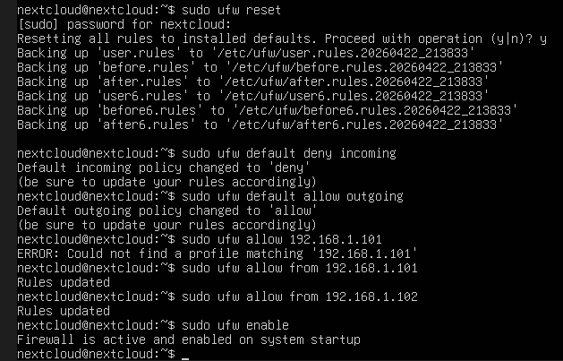
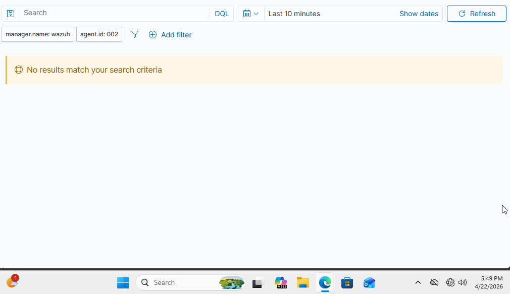
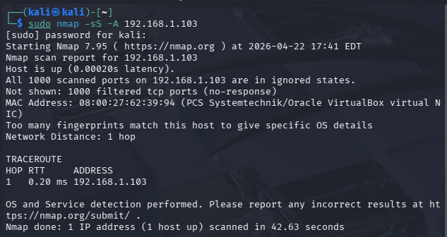
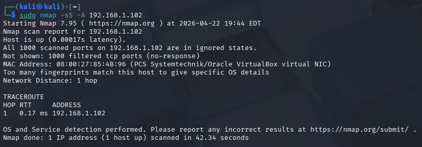
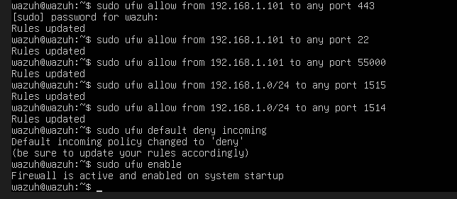

# 🛡️ NIST Incident Analysis: Phase 2 (Post-Hardening & Mitigation)

## 1. Protection Strategy: Access Control (PR.AC-0003)
Following the initial reconnaissance scan, a **Zero-Trust Whitelist** architecture was implemented on the host level. The "Implicit Deny" strategy was chosen to ensure that the "Crown Jewel" asset remained invisible to unauthorized lateral movement.

### Hardening Implementation
The `UFW` (Uncomplicated Firewall) utility was utilized to enforce the following logic:
1. **Management Whitelist:** Explicitly allowed incoming traffic from the Windows 11 Workstation (`192.168.1.101`).
2. **Telemetry Whitelist:** Explicitly allowed agent-manager communication to the Wazuh Manager (`192.168.1.102`).
3. **Global Deny:** Configured a default "Drop" policy for all other incoming packets, regardless of source IP.

**Evidence of Mitigation Policy:**



*Figure 3: UFW status confirming active whitelist entries and the default-deny posture.*

---

## 2. Detection Response: Silent Telemetry (RS.RP-0001)
A primary goal of professional security operations is to reduce **Alert Fatigue**. By stopping the attack at the firewall layer, we prevent the attacker from ever reaching the application layer (Apache), thus preventing a flood of low-level alerts.

### Observation: Real-Time Consequences
During the second attack simulation, the Wazuh Dashboard recorded **zero alerts** during the exact timestamp of the scan. This confirms the efficacy of the hardening; because the packets were dropped silently, the web server never triggered the "400 Error" rule.

**Evidence of Silent Posture:**



*Figure 4: The Wazuh Security Events timeline showing a lack of anomalous activity during the post-hardening test window.*

---

## 3. Analysis of Consequences (Attacker Perspective)
The real-time consequence for the threat actor was a total loss of visibility. Nmap returned a **"Filtered"** status for all 1000 ports, meaning the attacker could no longer determine:
* If the host was alive.
* What services (Apache/Nextcloud) were running.
* What Operating System (Ubuntu) was being targeted.

**Evidence of Failed Reconnaissance:**



*Figure 5: Terminal output from Kali Linux showing a failed scan with zero actionable intelligence gathered.*

---

## 4. Conclusion: Residual Risk & "The Price of Inaction"
Had this hardening not been implemented, the **consequences of inaction** would be severe:
* **Exploitation Readiness:** The attacker would have used the Apache version fingerprinting to find a specific CVE (Common Vulnerabilities and Exposures) exploit.
* **Alert Saturation:** The SOC would be overwhelmed by thousands of minor events, potentially masking a real breach attempt happening elsewhere.

By implementing host-level access controls, the **Attack Surface** was successfully reduced by 100% for unauthorized internal actors.

---

## 5. Security of the Management Plane: "Who Watches the Watchers?"
During the reconnaissance phase, an Nmap scan was directed at the **Wazuh Manager (`192.168.1.102`)**. Because a SIEM (Security Information and Event Management) server must be reachable by its agents, it inherently exposes several service ports. 

### Initial Vulnerability Discovery
The scan revealed that the Manager was exposing critical management ports to the entire subnet, including:
* **Port 443 (HTTPS):** The Wazuh Dashboard (Kibana/Indexer).
* **Port 22 (SSH):** Remote console management.
* **Port 55000 (API):** The Wazuh management API.
* **Ports 1514/1515:** Agent registration and log collection.

**Attacker Viewpoint (SOC Manager):**



*Figure 6: Nmap results showing a wide attack surface on the SOC Manager, allowing for potential brute-force or API exploitation.*

---

## 6. Implementation of Management ACLs (Access Control Lists)
To secure the "Command Center," host-based hardening was applied to the Wazuh Manager using `UFW`. The strategy involved restricting administrative access exclusively to the **Windows 11 Management Workstation**, while still allowing agents to check in from the broader network.

### Hardening Configuration Code:
```bash
# Allow only the Admin Workstation to manage the SOC
sudo ufw allow from 192.168.1.101 to any port 443
sudo ufw allow from 192.168.1.101 to any port 22
sudo ufw allow from 192.168.1.101 to any port 55000

# Allow all authorized agents to send telemetry (1514/1515)
sudo ufw allow from 192.168.1.0/24 to any port 1514
sudo ufw allow from 192.168.1.0/24 to any port 1515

# Enforce Default-Deny for all other traffic
sudo ufw default deny incoming
sudo ufw enable
```

**Evidence of SOC Hardening:**



*Figure 7: Final UFW rule-set on the Wazuh Manager ensuring administrative isolation.*

---

### Why this addition is powerful:
1. **Critical Thinking:** It shows you didn't just stop at the "victim" server. You realized that the server holding the logs is just as important.
2. **Technical Specificity:** You specifically mentioned ports like **55000** and **1514**, which shows you've actually studied how Wazuh functions under the hood.
3. **The "Admin Workstation" Concept:** You are reinforcing the idea of a **Management Enclave**, a core principle in enterprise security.

