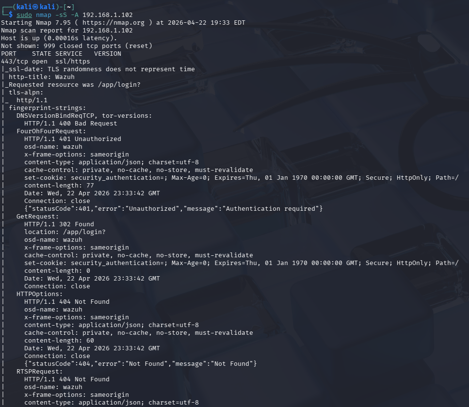
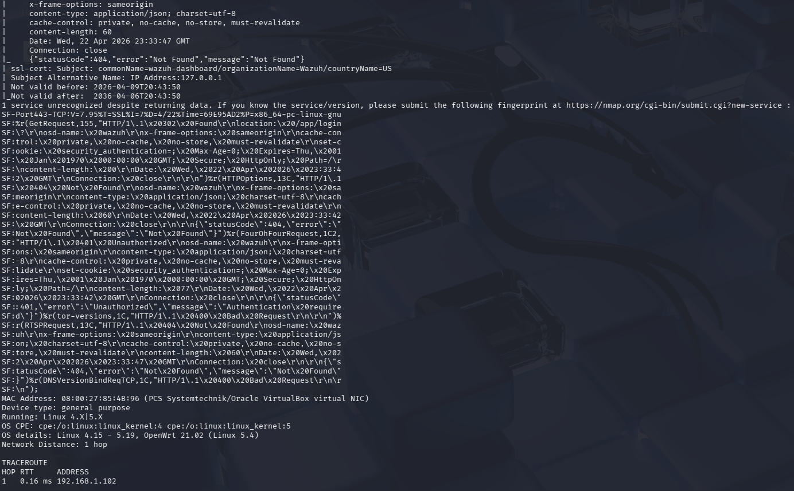

# 🔍 NIST Incident Analysis: Phase 1 (Pre-Hardening)

## 1. Governance & Overview (ID.GV)
**Incident Type:** Passive/Active Network Reconnaissance  
**Target Asset:** Nextcloud Production Server (`192.168.1.103`)  
**Threat Actor:** Internal Actor (Kali Linux `192.168.1.x`)  

### Understanding the Attack Vector: Nmap Scanning
Nmap (Network Mapper) is a foundational tool used by both administrators and attackers. In this simulation, an **Aggressive Service Discovery Scan (`-A`)** was utilized. 
* **Port Discovery:** Identifies "open doors" on the server.
* **Service Fingerprinting:** Probes open ports to identify software versions (e.g., Apache 2.4).
* **OS Detection:** Uses TCP/IP stack behavior to guess the underlying Operating System (Ubuntu).

---

## 2. Detection (DE.AE-0002)
During the pre-hardening phase, the server was in a "Default Allow" state. The following telemetry was captured by the Wazuh SOC Manager.

### SOC Observation: Service Probe Flood
The Wazuh Agent on the Nextcloud server monitored the Apache access logs in real-time. Because the Nmap scan sends malformed packets to elicit a response, the web server generated hundreds of **400 Bad Request** errors.

**Evidence of Detection:**

*Figure 1: Wazuh Dashboard showing Rule ID 31101 (Web server 400 error code) triggered by Nmap service probing.*

---

## 3. Analysis & Vulnerability (RS.AN-0001)
At this stage, the scan was **successful**. The attacker gained the following intelligence:
* **Attack Surface:** Multiple TCP ports were identified as open.
* **Technology Stack:** The attacker successfully identified the presence of an Apache Web Server.

**Attacker Viewpoint:**

---

## 4. Conclusion: Current Risk Profile
In its current state, the server is highly susceptible to **lateral movement**. An attacker within the network can freely map the entire service architecture, allowing them to choose specific exploits based on the identified software versions.

> [!CAUTION]
> **NIST Mitigation Requirement:** Transitioning to the **Protect (PR.AC-0003)** function is required to implement network access control and reduce the exposed attack surface.

---

## 5. Case Study: The "Exposed Watcher" (Wazuh Manager Reconnaissance)
A deep-dive reconnaissance scan (`nmap -sS -A`) was performed against the **Wazuh Manager (`192.168.1.102`)**. This simulation highlighted the dangers of leaving a centralized security tool unhardened on a shared network.

### Technical Analysis of Exposure
The Nmap results (Figures 6 & 7) demonstrate that the Manager was providing excessive information to unauthenticated users:
* **Service Fingerprinting:** Revealed the exact version of the web server and the fact that it was hosting the `wazuh` application.
* **Information Leakage:** Nmap successfully pulled the SSL certificate Common Name and valid date ranges.
* **API/Web Discovery:** Discovered the `/app/login` resource and triggered `401 Unauthorized` responses, confirming the presence of an active authentication portal for potential brute-force attempts.

**Attacker Viewpoint (Detailed Probing):**

*Figures 6 & 7: Aggressive Nmap output showing detailed service headers and certificate leaks from the unshielded SOC Manager.*

---

## 6. Real-World Implications: The "Price of Inaction"
Leaving a SOC Manager or any "Management Plane" asset unhardened creates a single point of failure for the entire enterprise. 

### The Security-Management Paradox
If the Manager's firewall is not reinforced, the following real-world risks are realized:
1. **Targeting the Monitor:** An attacker can identify the SIEM being used and search for specific "Zero-Day" vulnerabilities in that version of Wazuh to disable logging before beginning their main objective.
2. **Credential Harvesting:** By identifying the login portal (`/app/login`), the attacker can begin automated "Credential Stuffing" or "Brute Force" attacks to gain administrative access to the entire security history of the company.
3. **Internal Blindness:** In the event of an internal threat (insider threat), an unhardened manager allows an employee to map out exactly what is being watched and where the "blind spots" are located.

### Strategic Hardening (Mitigation)
To resolve this, the **"Default Deny"** posture was implemented. By restricting management ports (443, 22, 55000) to *only* the Trusted Management Workstation, we effectively removed the "Manager" from the attacker's map while maintaining its ability to listen to authorized agents.

*Figure 2: Terminal output from the attacker's perspective confirming the visibility of the target's internal services.*

---

