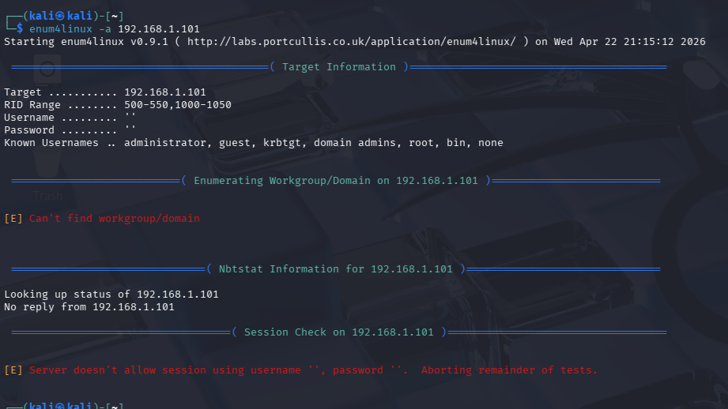

# 📂 NIST Incident Analysis: SMB Null Session Probing

## 1. Attack Overview
**Vector:** SMB Null Session Enumeration (`enum4linux`)
**Target:** Windows 11 Management Workstation (`192.168.1.101`)

### The "Null Session" Vulnerability
An attacker attempts to establish an unauthenticated connection to the IPC$ share. If successful, this allows for the "enumeration" of user accounts, share names, and password policies without providing credentials.

---

## 2. Initial Result: Modern OS Resilience

*Figure 9: Kali Linux output showing a failed Null Session attempt. Modern Windows 11 security policies restricted the anonymous bind.*

---

## 3. Real-World Risk: The "Legacy" Trap
While modern defaults blocked this specific probe, many enterprise environments disable these protections to support legacy hardware (e.g., old scanners/printers). This creates a massive hole for lateral movement.

---

## 4. Administrative Controls & Security Policy (ID.GV-0001)
During this simulation, the Windows 11 target remained resilient to Null Session enumeration due to modern OS defaults (**Password Protected Sharing: ON**). While it is tempting to disable these protections for ease of use in a Small-to-Medium Business (SMB) environment, doing so creates a critical vulnerability for credential harvesting.

### The Corporate Password Standard
Technical controls must be supported by a robust, enforced Password Policy. To mitigate the risk of unauthorized access via SMB or other network protocols, the following standards are mandated:

* **Multifactor Authentication (MFA):** Required for all system access, ensuring that a stolen password alone is insufficient for entry.
* **Rotation Policy:** Passwords must be changed every 60 days to reduce the "shelf life" of potentially compromised credentials.
* **Complexity & Length:** A minimum of 14 characters, including a mix of uppercase, lowercase, numbers, and special characters, to resist modern brute-force attacks.

> [!WARNING]
> **Universal Compliance Requirement**
> Security policies are only effective if enforced universally. "Privilege Creep" often leads to senior leadership or IT staff bypassing these requirements for convenience. In this lab, it is demonstrated that a single misconfiguration by an administrator (such as disabling password sharing) can bypass all other hardening efforts. **Policy must apply to all levels of the organization without exception.**
